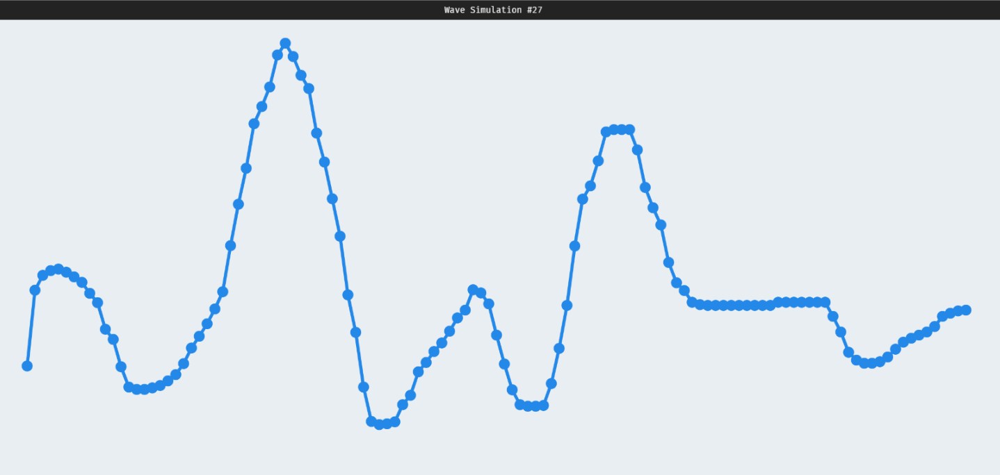

# Wave Simulation #27

> Finalmente funcionou!!!

## Funcionamento
  Cada partícula transporta energia (no código, velocidade (energia cinética (kinda))) para as partículas adjacentes. Como, pelo princípio de Huygens --
que em tese não pode ser aplicado para ondas 2D (no meu pc funciona...) -- cada ponto de uma frente de onda gera frentes de onda secundárias
que *só vão para frente*, cada partícula possui uma velocidade que no próximo frame será passada para a partícula da esquerda e uma que será passada
para a da direita. Sim, a velocidade da onda é determinada pelo FPS...

Caso uma velocidade sendo transmitida para a direita chegue à extremidade direita, a fase da onda é invertida e passa a ir para a esquerda (reflexão)

~~nossa, esse texto ficou meio ruim~~

## TODO:
> Coisas a serem melhoradas
- Velocidade independente do FPS
- Partículas das extremidades fixas/soltas